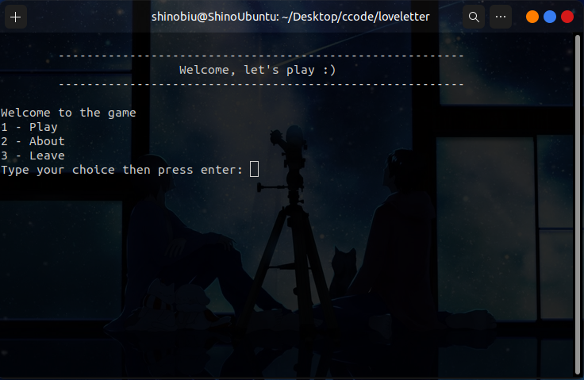
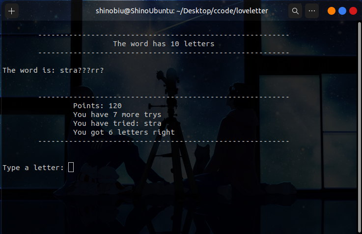
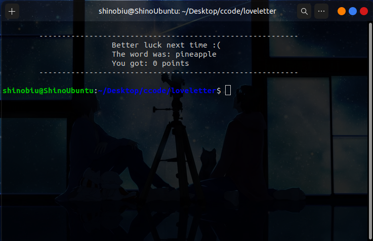

# Welcome to Love Letter

## Love letter is a small "guess the word game" writen in C++ for Linux.

Try your best to figure out the word.</br>

#

### To start playing first we have to compile it. 👨‍💻

Open the folder in your terminal and run this command:

```
g++ forca.cpp -o loveletter
```

Then run it

```
./loveletter
```

### First Screen, just type 1 to play 



### Now let's go 😎



### Victory 🥳


### Oh no! 😢



### Progress 📊

-   [x] Menu with choices
-   [x] Give a random word
-   [x] Show mask and number of letters
-   [x] Life or number of trys
-   [x] Show letters that have already been played
-   [x] Check if the letter played is a match inside the word
-   [ ] Time playing
-   [x] Points system
-   [ ] Multiplayer mode
-   [ ] Some cool easter egg
